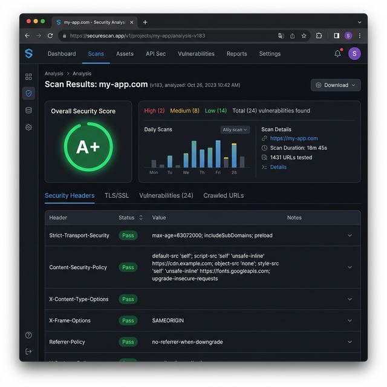

# HeaderGrade

HeaderGrade is a fast and local HTTP security header scanner built in Go. It allows you to analyze website security headers (similar to online tools) entirely on your local machine or internal network.

[](screenshot.png)

## Features

* **Comprehensive Scanning**: Checks for critical security headers such as `Strict-Transport-Security`, `Content-Security-Policy`, `X-Frame-Options`, and more.
* **Modern Web Interface**: Clean, responsive design featuring both Light and Dark themes.
* **Stand-alone Application**: All HTML, CSS, and JavaScript are embedded directly into a tiny single compiled binary using `//go:embed`.
* **Smart URL State**: Saves your queries directly to the URL, enabling browser history navigation and easy test sharing.
* **Actionable Reporting**: Provides a clear grading system (from A+ down to F) with detailed feedback on the presence and absence of important security flags.

## Installation

Because HeaderGrade packages its static assets into the Go binary, you can install and use it directly using the `go install` command without needing to manually clone the repository.

```bash
go install github.com/yourusername/headergrade@latest
```

*(Ensure that your `GOPATH/bin` is added to your system `PATH` to run the command directly).*

## Usage

Start the server using the compiled executable:

```bash
headergrade
```

By default, the server will start on port `8002`. Open your web browser and navigate to:

```
http://localhost:8002
```

Enter any valid target URL and select whether to follow HTTP redirects to get an instant breakdown of the target's security posture.

## How It Works

HeaderGrade masks its HTTP requests as a standard modern web browser to ensure that advanced security rules (which some CDNs or WAFs only serve to standard user-agents) are accurately captured. It then compares the returned raw headers against an internal rule map to generate the final grade.

## Development

If you prefer to clone and run the source code directly:

```bash
git clone https://github.com/yourusername/headergrade.git
cd headergrade
go run main.go
```

## License

This project is licensed under the MIT License.
